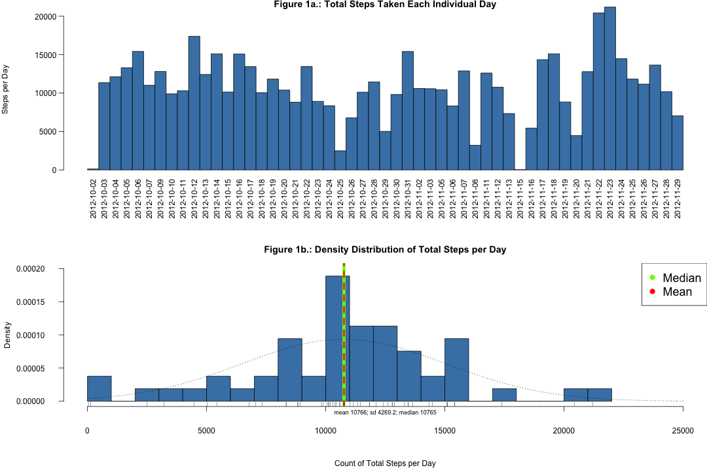
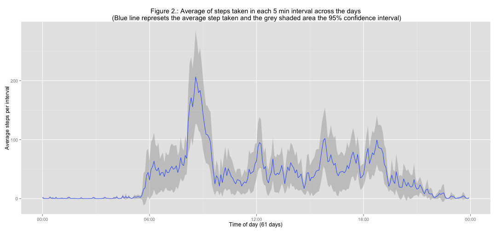
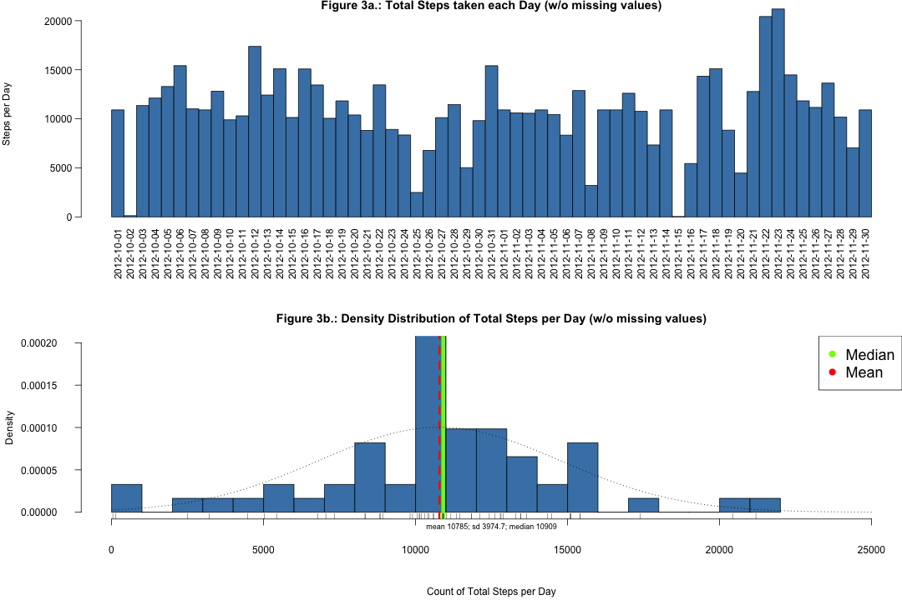
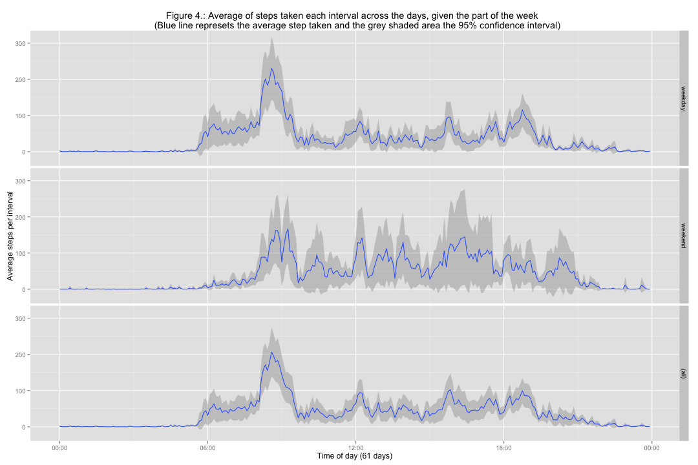

Reproducible Research: Peer Assessment 1
========================================================


## Introduction

It is now possible to collect a large amount of data about personal movement using activity monitoring devices such as a [Fitbit](http://www.fitbit.com/), [Nike Fuelband](http://www.nike.com/us/en_us/c/nikeplus-fuelband), or [Jawbone Up](https://jawbone.com/up). These type of devices are part of the "quantified self" movement -- a group of enthusiasts who take measurements about themselves regularly to improve their health, to find patterns in their behavior, or because they are tech geeks. But these data remain under-utilized both because the raw data are hard to obtain and there is a lack of statistical methods and software for processing and interpreting the data.

This assignment makes use of data from a personal activity monitoring device. This device collects data at 5 minute intervals through out the day. The data consists of two months of data from an anonymous individual collected during the months of October and November, 2012 and include the number of steps taken in 5 minute intervals each day. The **goal of this assignment** is to use this data set to perform a basic exploratory data analysis to assess the individual's activity patterns.


## Data

The dataset for this assignment can be downloaded from the course web site [Activity monitoring data](https://d396qusza40orc.cloudfront.net/repdata%2Fdata%2Factivity.zip) [52K] or via the [GitHub repository](http://github.com/rdpeng/RepData_PeerAssessment1) created for this assignment.

The dataset is stored in a comma-separated-value (CSV) file and there are a total of 17,568 observations in this dataset.

The **variables** included in this dataset are:

1. Column 1 - `steps`: Number of steps taken in a 5-minute interval (missing values are coded as `NA`)

2. Column 2 - `date`: The date on which the measurement was taken in `YYYY-MM-DD` format

3. Column 3 - `interval`: Identifier for the 5-minute interval in which measurement was taken.

##1. Loading in and preprocessing data

### 1.1. Objectives
Show any code that is needed to:

1. Load the data (i.e. `read.csv()`)

2. Process/transform the data (if necessary) into a format suitable for your analysis


### 1.2. Download and Load Dataset
For completeness and to ensure reproducibility we will download the data set programatically. The code bellow **downloads**, **unzips** and **loads** the `activity.csv` file from the course web site if it is not yet present in the data file in the working directory. The data frame is assigned to a variable called `activity`.


```r
#Verify if activity.csv file already exixts in data directory and download and 
#unzip it otherwise.
if (!file.exists("data/activity.csv")) {
        if (!file.exists("data")) {
                message("Creating data directory...")
                dir.create("data")
                }
       fileURL <- "https://d396qusza40orc.cloudfront.net/repdata%2Fdata%2Factivity.zip"
       zipfile <- "activity.zip"
       message("Downloading data...")
       download.file(fileURL, destfile=zipfile, method="curl")
       unzip(zipfile, exdir="data")
       }
#Load the csv file and assign it to a variable
activity <- read.csv("data/activity.csv", stringsAsFactors = FALSE)
```

###1.3. Exploring the variables
Bellow we can have an overview of this data frame.

```r
str(activity)
```

```
## 'data.frame':	17568 obs. of  3 variables:
##  $ steps   : int  NA NA NA NA NA NA NA NA NA NA ...
##  $ date    : chr  "2012-10-01" "2012-10-01" "2012-10-01" "2012-10-01" ...
##  $ interval: int  0 5 10 15 20 25 30 35 40 45 ...
```
Note that `date` is represented as `character` in the the format `YYY-MM-DD`. 

```r
summary(activity)
```

```
##      steps            date              interval     
##  Min.   :  0.00   Length:17568       Min.   :   0.0  
##  1st Qu.:  0.00   Class :character   1st Qu.: 588.8  
##  Median :  0.00   Mode  :character   Median :1177.5  
##  Mean   : 37.38                      Mean   :1177.5  
##  3rd Qu.: 12.00                      3rd Qu.:1766.2  
##  Max.   :806.00                      Max.   :2355.0  
##  NA's   :2304
```

```r
library(data.table)
```

```
## data.table 1.9.4  For help type: ?data.table
## *** NB: by=.EACHI is now explicit. See README to restore previous behaviour.
```

```r
data.table(activity)
```

```
##        steps       date interval
##     1:    NA 2012-10-01        0
##     2:    NA 2012-10-01        5
##     3:    NA 2012-10-01       10
##     4:    NA 2012-10-01       15
##     5:    NA 2012-10-01       20
##    ---                          
## 17564:    NA 2012-11-30     2335
## 17565:    NA 2012-11-30     2340
## 17566:    NA 2012-11-30     2345
## 17567:    NA 2012-11-30     2350
## 17568:    NA 2012-11-30     2355
```
Another important observation is that the variable `interval` is merely an `period identifier` represented as `integer` and it does not correspond to the expected value of cumulative adition of 5 minutes time per interval all the way through the 61 days (2012-10-01 to 2012-11-30). Each day has `288` 5-minutes intervals (`24hs * 60 = 1440 minutes, 1440/5 = 288`). However in this dataset the 24 hour interval goes from `0` to `2355`. 


```r
activity$interval[1:600]
```

```
##   [1]    0    5   10   15   20   25   30   35   40   45   50   55  100  105
##  [15]  110  115  120  125  130  135  140  145  150  155  200  205  210  215
##  [29]  220  225  230  235  240  245  250  255  300  305  310  315  320  325
##  [43]  330  335  340  345  350  355  400  405  410  415  420  425  430  435
##  [57]  440  445  450  455  500  505  510  515  520  525  530  535  540  545
##  [71]  550  555  600  605  610  615  620  625  630  635  640  645  650  655
##  [85]  700  705  710  715  720  725  730  735  740  745  750  755  800  805
##  [99]  810  815  820  825  830  835  840  845  850  855  900  905  910  915
## [113]  920  925  930  935  940  945  950  955 1000 1005 1010 1015 1020 1025
## [127] 1030 1035 1040 1045 1050 1055 1100 1105 1110 1115 1120 1125 1130 1135
## [141] 1140 1145 1150 1155 1200 1205 1210 1215 1220 1225 1230 1235 1240 1245
## [155] 1250 1255 1300 1305 1310 1315 1320 1325 1330 1335 1340 1345 1350 1355
## [169] 1400 1405 1410 1415 1420 1425 1430 1435 1440 1445 1450 1455 1500 1505
## [183] 1510 1515 1520 1525 1530 1535 1540 1545 1550 1555 1600 1605 1610 1615
## [197] 1620 1625 1630 1635 1640 1645 1650 1655 1700 1705 1710 1715 1720 1725
## [211] 1730 1735 1740 1745 1750 1755 1800 1805 1810 1815 1820 1825 1830 1835
## [225] 1840 1845 1850 1855 1900 1905 1910 1915 1920 1925 1930 1935 1940 1945
## [239] 1950 1955 2000 2005 2010 2015 2020 2025 2030 2035 2040 2045 2050 2055
## [253] 2100 2105 2110 2115 2120 2125 2130 2135 2140 2145 2150 2155 2200 2205
## [267] 2210 2215 2220 2225 2230 2235 2240 2245 2250 2255 2300 2305 2310 2315
## [281] 2320 2325 2330 2335 2340 2345 2350 2355    0    5   10   15   20   25
## [295]   30   35   40   45   50   55  100  105  110  115  120  125  130  135
## [309]  140  145  150  155  200  205  210  215  220  225  230  235  240  245
## [323]  250  255  300  305  310  315  320  325  330  335  340  345  350  355
## [337]  400  405  410  415  420  425  430  435  440  445  450  455  500  505
## [351]  510  515  520  525  530  535  540  545  550  555  600  605  610  615
## [365]  620  625  630  635  640  645  650  655  700  705  710  715  720  725
## [379]  730  735  740  745  750  755  800  805  810  815  820  825  830  835
## [393]  840  845  850  855  900  905  910  915  920  925  930  935  940  945
## [407]  950  955 1000 1005 1010 1015 1020 1025 1030 1035 1040 1045 1050 1055
## [421] 1100 1105 1110 1115 1120 1125 1130 1135 1140 1145 1150 1155 1200 1205
## [435] 1210 1215 1220 1225 1230 1235 1240 1245 1250 1255 1300 1305 1310 1315
## [449] 1320 1325 1330 1335 1340 1345 1350 1355 1400 1405 1410 1415 1420 1425
## [463] 1430 1435 1440 1445 1450 1455 1500 1505 1510 1515 1520 1525 1530 1535
## [477] 1540 1545 1550 1555 1600 1605 1610 1615 1620 1625 1630 1635 1640 1645
## [491] 1650 1655 1700 1705 1710 1715 1720 1725 1730 1735 1740 1745 1750 1755
## [505] 1800 1805 1810 1815 1820 1825 1830 1835 1840 1845 1850 1855 1900 1905
## [519] 1910 1915 1920 1925 1930 1935 1940 1945 1950 1955 2000 2005 2010 2015
## [533] 2020 2025 2030 2035 2040 2045 2050 2055 2100 2105 2110 2115 2120 2125
## [547] 2130 2135 2140 2145 2150 2155 2200 2205 2210 2215 2220 2225 2230 2235
## [561] 2240 2245 2250 2255 2300 2305 2310 2315 2320 2325 2330 2335 2340 2345
## [575] 2350 2355    0    5   10   15   20   25   30   35   40   45   50   55
## [589]  100  105  110  115  120  125  130  135  140  145  150  155
```

This discrepancy can be explained by the *jumps* in the `interval` label every end of hour period (`55` to `100`, `155 to 200`, `255` to `300` and so forth). This can be confirmed by the code bellow. If we count the number of unique `interval` values it matches the expected `288` 5-minutes intervals in a 24 hour period
. This *jumps* after every `55` minutes to the next centimal actually represent one `hour` complete. In this way the interval `55` = 55M, `100` = 1H 00M, `155` = 1H 55M, `200` = 2H 00M, ...

```r
length(unique(activity$interval))
```

```
## [1] 288
```
Furthermore each `interval` label `0:2355` is repeated `61` times as we would expect by the number of days represented in this data set.

```r
table(activity$interval)
```

```
## 
##    0    5   10   15   20   25   30   35   40   45   50   55  100  105  110 
##   61   61   61   61   61   61   61   61   61   61   61   61   61   61   61 
##  115  120  125  130  135  140  145  150  155  200  205  210  215  220  225 
##   61   61   61   61   61   61   61   61   61   61   61   61   61   61   61 
##  230  235  240  245  250  255  300  305  310  315  320  325  330  335  340 
##   61   61   61   61   61   61   61   61   61   61   61   61   61   61   61 
##  345  350  355  400  405  410  415  420  425  430  435  440  445  450  455 
##   61   61   61   61   61   61   61   61   61   61   61   61   61   61   61 
##  500  505  510  515  520  525  530  535  540  545  550  555  600  605  610 
##   61   61   61   61   61   61   61   61   61   61   61   61   61   61   61 
##  615  620  625  630  635  640  645  650  655  700  705  710  715  720  725 
##   61   61   61   61   61   61   61   61   61   61   61   61   61   61   61 
##  730  735  740  745  750  755  800  805  810  815  820  825  830  835  840 
##   61   61   61   61   61   61   61   61   61   61   61   61   61   61   61 
##  845  850  855  900  905  910  915  920  925  930  935  940  945  950  955 
##   61   61   61   61   61   61   61   61   61   61   61   61   61   61   61 
## 1000 1005 1010 1015 1020 1025 1030 1035 1040 1045 1050 1055 1100 1105 1110 
##   61   61   61   61   61   61   61   61   61   61   61   61   61   61   61 
## 1115 1120 1125 1130 1135 1140 1145 1150 1155 1200 1205 1210 1215 1220 1225 
##   61   61   61   61   61   61   61   61   61   61   61   61   61   61   61 
## 1230 1235 1240 1245 1250 1255 1300 1305 1310 1315 1320 1325 1330 1335 1340 
##   61   61   61   61   61   61   61   61   61   61   61   61   61   61   61 
## 1345 1350 1355 1400 1405 1410 1415 1420 1425 1430 1435 1440 1445 1450 1455 
##   61   61   61   61   61   61   61   61   61   61   61   61   61   61   61 
## 1500 1505 1510 1515 1520 1525 1530 1535 1540 1545 1550 1555 1600 1605 1610 
##   61   61   61   61   61   61   61   61   61   61   61   61   61   61   61 
## 1615 1620 1625 1630 1635 1640 1645 1650 1655 1700 1705 1710 1715 1720 1725 
##   61   61   61   61   61   61   61   61   61   61   61   61   61   61   61 
## 1730 1735 1740 1745 1750 1755 1800 1805 1810 1815 1820 1825 1830 1835 1840 
##   61   61   61   61   61   61   61   61   61   61   61   61   61   61   61 
## 1845 1850 1855 1900 1905 1910 1915 1920 1925 1930 1935 1940 1945 1950 1955 
##   61   61   61   61   61   61   61   61   61   61   61   61   61   61   61 
## 2000 2005 2010 2015 2020 2025 2030 2035 2040 2045 2050 2055 2100 2105 2110 
##   61   61   61   61   61   61   61   61   61   61   61   61   61   61   61 
## 2115 2120 2125 2130 2135 2140 2145 2150 2155 2200 2205 2210 2215 2220 2225 
##   61   61   61   61   61   61   61   61   61   61   61   61   61   61   61 
## 2230 2235 2240 2245 2250 2255 2300 2305 2310 2315 2320 2325 2330 2335 2340 
##   61   61   61   61   61   61   61   61   61   61   61   61   61   61   61 
## 2345 2350 2355 
##   61   61   61
```

Therefore we will process the variable `date` to a proper date class and use the `interval` variable to create a time variable to facilitate the evaluation of the time past and make them more useful for further analysis.

###1.4. Data set processing

####1.4.1. Convert date variable to a proper date class 
The `date` variable was converted to `POSIXct` `POSIXt`.

```r
library(lubridate)
```

```
## 
## Attaching package: 'lubridate'
## 
## The following objects are masked from 'package:data.table':
## 
##     hour, mday, month, quarter, wday, week, yday, year
```

```r
#The lubridate ymd function formats the date aproprietly
activity$date <- ymd(activity$date)
class(activity$date)
```

```
## [1] "POSIXct" "POSIXt"
```

####1.4.2. Create a time variable column
The value of `interval` is formated and converted to proper time `periods` and then to `time` and asigned to a new column `time`.

```r
#Format interval values with formatC and convert to period (with lubridate hm) 
#and then to "POSIXct" "POSIXt" 
activity$time <- as.POSIXct(hm(formatC(
                                activity$interval / 100, 2, format='f')),
                                format='%H:%M:%S', 
                                origin = activity$date[1], 
                                tz='GMT')

class(activity$time)
```

```
## [1] "POSIXct" "POSIXt"
```

####1.4.3. Create a weekday column
Part of the assigment will be to assess differences in activity between days of the week. Therefore a weekday column was created to assist this analysis

```r
activity$weekday <- wday(activity$date, label=TRUE,abbr=TRUE)
str(activity$weekday)
```

```
##  Ord.factor w/ 7 levels "Sun"<"Mon"<"Tues"<..: 2 2 2 2 2 2 2 2 2 2 ...
```

####1.4.4. Browse the processed data set
Now we can double check the data set to make sure everything is how we would like it to be, with the variables in their correct form.

```r
str(activity)
```

```
## 'data.frame':	17568 obs. of  5 variables:
##  $ steps   : int  NA NA NA NA NA NA NA NA NA NA ...
##  $ date    : POSIXct, format: "2012-10-01" "2012-10-01" ...
##  $ interval: int  0 5 10 15 20 25 30 35 40 45 ...
##  $ time    : POSIXct, format: "2012-10-01 00:00:00" "2012-10-01 00:05:00" ...
##  $ weekday : Ord.factor w/ 7 levels "Sun"<"Mon"<"Tues"<..: 2 2 2 2 2 2 2 2 2 2 ...
```

```r
summary(activity)
```

```
##      steps             date               interval     
##  Min.   :  0.00   Min.   :2012-10-01   Min.   :   0.0  
##  1st Qu.:  0.00   1st Qu.:2012-10-16   1st Qu.: 588.8  
##  Median :  0.00   Median :2012-10-31   Median :1177.5  
##  Mean   : 37.38   Mean   :2012-10-31   Mean   :1177.5  
##  3rd Qu.: 12.00   3rd Qu.:2012-11-15   3rd Qu.:1766.2  
##  Max.   :806.00   Max.   :2012-11-30   Max.   :2355.0  
##  NA's   :2304                                          
##       time                      weekday    
##  Min.   :2012-10-01 00:00:00   Sun  :2304  
##  1st Qu.:2012-10-01 05:58:45   Mon  :2592  
##  Median :2012-10-01 11:57:30   Tues :2592  
##  Mean   :2012-10-01 11:57:30   Wed  :2592  
##  3rd Qu.:2012-10-01 17:56:15   Thurs:2592  
##  Max.   :2012-10-01 23:55:00   Fri  :2592  
##                                Sat  :2304
```

```r
data.table(activity)
```

```
##        steps       date interval                time weekday
##     1:    NA 2012-10-01        0 2012-10-01 00:00:00     Mon
##     2:    NA 2012-10-01        5 2012-10-01 00:05:00     Mon
##     3:    NA 2012-10-01       10 2012-10-01 00:10:00     Mon
##     4:    NA 2012-10-01       15 2012-10-01 00:15:00     Mon
##     5:    NA 2012-10-01       20 2012-10-01 00:20:00     Mon
##    ---                                                      
## 17564:    NA 2012-11-30     2335 2012-10-01 23:35:00     Fri
## 17565:    NA 2012-11-30     2340 2012-10-01 23:40:00     Fri
## 17566:    NA 2012-11-30     2345 2012-10-01 23:45:00     Fri
## 17567:    NA 2012-11-30     2350 2012-10-01 23:50:00     Fri
## 17568:    NA 2012-11-30     2355 2012-10-01 23:55:00     Fri
```

## 2. Question 1: What is the mean total number of steps taken per day?

### 2.1. Objectives

For this part of the assignment, we can **ignore the missing values** in the dataset.

1. Make a `histogram` of the total number of steps taken each day

2. Calculate and report the `mean` and `median` total number of steps taken per day

### 2.2 Calculate the total number of steps per day and assign it to a variable

```r
#Compute the total number of steps per day and assign it to an object
TotalDailySteps <- aggregate(steps ~ date, data = activity, FUN = sum)
```
The total number of steps per day are the following:

```r
head(TotalDailySteps)
```

```
##         date steps
## 1 2012-10-02   126
## 2 2012-10-03 11352
## 3 2012-10-04 12116
## 4 2012-10-05 13294
## 5 2012-10-06 15420
## 6 2012-10-07 11015
```

```r
tail(TotalDailySteps)
```

```
##          date steps
## 48 2012-11-24 14478
## 49 2012-11-25 11834
## 50 2012-11-26 11162
## 51 2012-11-27 13646
## 52 2012-11-28 10183
## 53 2012-11-29  7047
```

### 2.3 Calculate the summary statistics of the total number of steps taken per day

```r
# Calculate summary statistics
summary(TotalDailySteps)
```

```
##       date                         steps      
##  Min.   :2012-10-02 00:00:00   Min.   :   41  
##  1st Qu.:2012-10-16 00:00:00   1st Qu.: 8841  
##  Median :2012-10-29 00:00:00   Median :10765  
##  Mean   :2012-10-30 17:12:27   Mean   :10766  
##  3rd Qu.:2012-11-16 00:00:00   3rd Qu.:13294  
##  Max.   :2012-11-29 00:00:00   Max.   :21194
```

**Objective 2***: The values of the `mean` (**10766 steps**) and the `median` (**10765 steps**) are almost identical. This is an indicative that the variability of the number of daily steps taken in this period of `61 days` follow a nearly `normal distribution`. This prediction can be verified by figure 1b below. 

### 2.4. Plot histograms to view the data
**Objective 1**

```r
with(TotalDailySteps, {
    
        #Setup plotting space.
        par(mfrow=c(2,1),mar=c(6.75,6.75,0.75,0), mgp=c(5.75,0.75,0), las=2)
    
        barplot( #plot total steps per day
                height=steps,
                main="Figure 1a.: Total Steps Taken Each Individual Day",
                ylab="Steps per Day",
                names.arg=TotalDailySteps$date,
                col="steelblue",
                space=c(0)
        )
        
        par(mar=c(6.75,6.75,3,0), mgp=c(5.5,2,0),las=1)
        
        hist(  #plot the distribution of total steps
                x = steps,
                xlim=c(0,25000),
                ylim=c(0, 0.0002),
                prob=TRUE,
                main = "Figure 1b.: Density Distribution of Total Steps per Day", 
                xlab= "Count of Total Steps per Day", 
                col="steelblue", 
                breaks = 30
        )
       
        #Assign mean and median values to variables to be used in the abline of plot 2
        mean.steps <- round(mean(TotalDailySteps$steps),0) # Mean
        median.steps <- quantile(x = TotalDailySteps$steps, probs = 0.5)  # Median, 50%Q
        
        # Add median and mean lines and their legends
        abline(v=median.steps, col="lawngreen", lwd=6)
        abline(v=mean.steps, lty = 2, col="red", lwd=3)
        legend("topright", 
               c("Median","Mean"),
               pch=c(16,16), 
               col=c("lawngreen","red"),
               cex=1.5
               )

        #Add rug
        rug(TotalDailySteps$steps)
        
        #Add values of mean, sd and median
        mtext(paste(
                "mean ", round(mean(TotalDailySteps$steps),0), 
                "; sd ", round(sd(TotalDailySteps$steps),1), 
                "; median ", quantile(x = TotalDailySteps$steps, probs = 0.5),
                sep=""), 
                side=1, 
                cex=.75)
        
        #Add a normal distribution line
        x <- TotalDailySteps$steps 
        curve(dnorm(
                x,
                mean=mean(TotalDailySteps$steps), 
                sd=sd(TotalDailySteps$steps)), 
                add=TRUE,
                col="black", 
                lty="dotted", 
                xaxt="n")

})
```

 

##3. Question 2: What is the average daily activity pattern?

### 3.1. Objectives
1. Make a time series plot of the 5-minute interval (x-axis) and the average number of steps taken, averaged across all days (y-axis)

2. Which 5-minute interval, on average across all the days in the dataset, contains the maximum number of steps?

### 3.2. Time series plot for the average five minute interval at a 95% confidence interval
**Objective 1**: Let’s take a look at a time series plot for the mean steps across the 5 minutes intervals of the averaged day.

```r
library(ggplot2)
library(scales)

# Function to calculate de mean and normal 
# 95% confidence interval around it
mean_ci <- function(data){
    m <- mean(data)
    data.frame(y=m,
               ymin = m-(1.96*sd(data)/sqrt(length(data))),
               ymax = m+(1.96*sd(data)/sqrt(length(data))))
}

# Plot the average number of steps per interval.
steps.period <- qplot(x=time, y=steps, data=subset(activity, complete.cases(activity)),
                        geom='smooth', stat='summary', fun.data=mean_ci) +
                        labs(title= "Figure 2.: Average of steps taken in each 5 min interval across the days\n (Blue line represets the average step taken and the grey shaded area the 95% confidence interval)",
                        y='Average steps per interval', x='Time of day (61 days)') +
                        scale_x_datetime(labels=date_format(format='%H:%M'))
steps.period
```

 

### 3.2. Calculate the mean steps for each five minute interval, and assign to a new data frame.

```r
time.activity <- tapply(activity$steps, activity$time, mean, na.rm=TRUE)
daily.pattern <- data.frame(time=as.POSIXct(names(time.activity)),
                            time.activity=time.activity)
```
Which **five minute interval** has the highest mean number of steps?

```r
highest <- which.max(daily.pattern$time.activity)
format(daily.pattern[highest,"time"], format='%H:%M')
```

```
## [1] "08:35"
```
The **maximum mean total steps** in this interval was:

```r
daily.pattern[[highest,"time.activity"]]
```

```
## [1] 206.1698
```
**Objective 2**: The 5 minutes period between **8:30** and **8:35** has on average the maximum number of steps over the 61 days analysed, with a step count over **206**.

##4. Imputing missing values

### 4.1. Objectives
Note that there are a number of days/intervals where there are missing values (coded as `NA`). The presence of missing days may introduce bias into some calculations or summaries of the data.

1. Calculate and report the total number of missing values in the dataset (i.e. the total number of rows with `NA`s)

2. Devise a strategy for filling in all of the missing values in the dataset. The strategy does not need to be sophisticated. For example, you could use the mean/median for that day, or the mean for that 5-minute interval, etc.

3. Create a new dataset that is equal to the original dataset but with the missing data filled in.

4. Make a histogram of the total number of steps taken each day and calculate and report the mean and median total number of steps taken per day. 

* Do these values differ from the estimates from the first part of the assignment? 

* What is the impact of imputing missing data on the estimates of the total daily number of steps?

### 4.2. Procedure

#### 4.2.1. Objective 1: Total number of missing values (NA) in the original data set

```r
nrow(subset(activity, is.na(activity$steps)))
```

```
## [1] 2304
```

#### 4.2.2. Objective 2 and 3: Input the missing values strategy and create a new complete data set
The average of each 5-minute interval values from the previous section is used to replace the NA values of the original data and a new dataset is generated. Decimal values will be rounded up to a whole number to avoid using fractional steps.

```r
#Assign all the values of `steps` from the original data set to a variable
stepValues <- data.frame(activity$steps)   
#Assign the values of the averaged steps (rounded up to an integer) to the missing values 
#of the new variable
stepValues[is.na(stepValues),] <- ceiling(tapply(
                        X=activity$steps,INDEX=activity$interval,FUN=mean,na.rm=TRUE))   
#Attach the new variable column to the new dataframe replacing the original steps column
newData <- cbind(stepValues, activity[,2:5])   
colnames(newData) <- c("Steps", "Date", "Interval", "Time", "Weekday")
```

Let's have a look at the new complete data set:

```r
str(newData)
```

```
## 'data.frame':	17568 obs. of  5 variables:
##  $ Steps   : num  2 1 1 1 1 3 1 1 0 2 ...
##  $ Date    : POSIXct, format: "2012-10-01" "2012-10-01" ...
##  $ Interval: int  0 5 10 15 20 25 30 35 40 45 ...
##  $ Time    : POSIXct, format: "2012-10-01 00:00:00" "2012-10-01 00:05:00" ...
##  $ Weekday : Ord.factor w/ 7 levels "Sun"<"Mon"<"Tues"<..: 2 2 2 2 2 2 2 2 2 2 ...
```

```r
summary(newData)
```

```
##      Steps             Date               Interval     
##  Min.   :  0.00   Min.   :2012-10-01   Min.   :   0.0  
##  1st Qu.:  0.00   1st Qu.:2012-10-16   1st Qu.: 588.8  
##  Median :  0.00   Median :2012-10-31   Median :1177.5  
##  Mean   : 37.45   Mean   :2012-10-31   Mean   :1177.5  
##  3rd Qu.: 27.00   3rd Qu.:2012-11-15   3rd Qu.:1766.2  
##  Max.   :806.00   Max.   :2012-11-30   Max.   :2355.0  
##                                                        
##       Time                      Weekday    
##  Min.   :2012-10-01 00:00:00   Sun  :2304  
##  1st Qu.:2012-10-01 05:58:45   Mon  :2592  
##  Median :2012-10-01 11:57:30   Tues :2592  
##  Mean   :2012-10-01 11:57:30   Wed  :2592  
##  3rd Qu.:2012-10-01 17:56:15   Thurs:2592  
##  Max.   :2012-10-01 23:55:00   Fri  :2592  
##                                Sat  :2304
```

```r
data.table(newData)
```

```
##        Steps       Date Interval                Time Weekday
##     1:     2 2012-10-01        0 2012-10-01 00:00:00     Mon
##     2:     1 2012-10-01        5 2012-10-01 00:05:00     Mon
##     3:     1 2012-10-01       10 2012-10-01 00:10:00     Mon
##     4:     1 2012-10-01       15 2012-10-01 00:15:00     Mon
##     5:     1 2012-10-01       20 2012-10-01 00:20:00     Mon
##    ---                                                      
## 17564:     5 2012-11-30     2335 2012-10-01 23:35:00     Fri
## 17565:     4 2012-11-30     2340 2012-10-01 23:40:00     Fri
## 17566:     1 2012-11-30     2345 2012-10-01 23:45:00     Fri
## 17567:     1 2012-11-30     2350 2012-10-01 23:50:00     Fri
## 17568:     2 2012-11-30     2355 2012-10-01 23:55:00     Fri
```

#### 4.2.3. Objective 4: Calculate new mean and median number of steps and make a histogram to display processed data.

##### 4.2.3.1 Calculate the total number of steps per day with complete data and assign it to an object

```r
#Compute the total number of steps per day
newDailyStepSum <- aggregate(newData$Steps, list(newData$Date), sum) 
colnames(newDailyStepSum) <- c("Date", "Steps")
```
The new total number of steps per day are the following:

```r
head(newDailyStepSum)
```

```
##         Date Steps
## 1 2012-10-01 10909
## 2 2012-10-02   126
## 3 2012-10-03 11352
## 4 2012-10-04 12116
## 5 2012-10-05 13294
## 6 2012-10-06 15420
```

```r
tail(newDailyStepSum)
```

```
##          Date Steps
## 56 2012-11-25 11834
## 57 2012-11-26 11162
## 58 2012-11-27 13646
## 59 2012-11-28 10183
## 60 2012-11-29  7047
## 61 2012-11-30 10909
```

##### 4.2.3.2 Calculate the summary statistics of the new total number of steps taken per day

```r
# Calculate summary statistics
summary(newDailyStepSum)
```

```
##       Date                Steps      
##  Min.   :2012-10-01   Min.   :   41  
##  1st Qu.:2012-10-16   1st Qu.: 9819  
##  Median :2012-10-31   Median :10909  
##  Mean   :2012-10-31   Mean   :10785  
##  3rd Qu.:2012-11-15   3rd Qu.:12811  
##  Max.   :2012-11-30   Max.   :21194
```

##### 4.2.3.3 histograms to view the new data


```r
with(newDailyStepSum, {       
        
        #Setup plotting space.
        par(mfrow=c(2,1),mar=c(6.75,6.75,0.75,0), mgp=c(5.75,0.75,0), las=2)
        
        barplot( #plot total steps per day
                height=Steps,
                main="Figure 3a.: Total Steps taken each Day (w/o missing values)",
                ylab="Steps per Day",
                names.arg=newDailyStepSum$Date,
                col="steelblue",
                space=c(0)
        )  
        par(mar=c(6.75,6.75,3,0), mgp=c(5.5,2,0),las=1)
        
        hist(  #plot the distribution of total steps
                x = Steps,
                xlim=c(0,25000),
                ylim=c(0, 0.0002),
                prob=TRUE,
                main = "Figure 3b.: Density Distribution of Total Steps per Day (w/o missing values)", 
                xlab= "Count of Total Steps per Day", 
                col="steelblue", 
                breaks = 30
        )
        
        #Assign mean and median values to variables to be used in the plot
        new.mean.steps <- mean(newDailyStepSum$Steps, na.rm = TRUE) # Mean
        new.median.steps <- quantile(x = newDailyStepSum$Steps, probs = 0.5) # Median, 50%Q
       
        # Add median and mean lines and their legends
        abline(v=new.median.steps, col="lawngreen", lwd=6)
        abline(v=new.mean.steps, lty = 2, col="red", lwd=3)
        legend("topright", 
               c("Median","Mean"),
               pch=c(16,16), 
               col=c("lawngreen","red"),
               cex=1.5
               )

        #Add rug
        rug(newDailyStepSum$Steps)
        
        #Add values of mean, sd and median
        mtext(paste(
                "mean ", round(mean(newDailyStepSum$Steps),0), 
                "; sd ", round(sd(newDailyStepSum$Steps),1), 
                "; median ", quantile(x = newDailyStepSum$Steps, probs = 0.5),
                sep=""), 
                side=1, 
                cex=.75)
        
        #Add a normal distribution line
        x <- newDailyStepSum$Steps 
        curve(dnorm(x,
                    mean=mean(newDailyStepSum$Steps), 
                    sd=sd(newDailyStepSum$Steps)
                    ),
              add=TRUE,
              col="black", 
              lty="dotted", 
              xaxt="n")

})
```

 

**Objective 4**: Both the values of the `mean` and the `median` have increased slightly with the new complete data set. The `mean` went from **10766 to 10785 steps** and the `median` went from **10765 to 10909 steps**. This shift in values did not profoundly affect the `normal distribution` with regards to the variability of the number of daily steps taken in this period of `61 days` as can be seen in **Figure 3b**.


##5. Question 3: Are there differences in activity patterns between weekdays and weekends?

### 5.1. Objectives
For this part the `weekdays()` function may be of some help here. Use the dataset with the filled-in missing values for this part.

1. Create a new factor variable in the dataset with two levels “weekday” and “weekend” indicating whether a given date is a weekday or weekend day.

2. Make a panel plot containing a time series plot (i.e. `type = "l"`) of the 5-minute interval (x-axis) and the average number of steps taken, averaged across all weekday days or weekend days (y-axis). See the README file in the [GitHub repository](http://github.com/rdpeng/RepData_PeerAssessment1) to see an example of what this plot should look like using simulated data.

###5.2. Insert new column for Weekend and Weekday
**Objective 1**: A new column indicating whether the date is a weekday or a weekend is added to the new dataset created in the previous section.

```r
dateDayType <- data.frame(sapply(X=newData$Date, FUN=function(day) { 
        
        if (weekdays(as.Date(day)) %in% c("Monday", "Tuesday", "Wednesday", "Thursday", "Friday")) 
                { day <- "weekday" 
                  } else { 
                          day <- "weekend" } }))


newDataWithDayType <- cbind(newData, dateDayType)
colnames(newDataWithDayType) <- c("steps", "date", "tnterval","time", "weekday", "dayType") 
```

Bellow is an overview of the data set:

```r
str(newDataWithDayType)
```

```
## 'data.frame':	17568 obs. of  6 variables:
##  $ steps   : num  2 1 1 1 1 3 1 1 0 2 ...
##  $ date    : POSIXct, format: "2012-10-01" "2012-10-01" ...
##  $ tnterval: int  0 5 10 15 20 25 30 35 40 45 ...
##  $ time    : POSIXct, format: "2012-10-01 00:00:00" "2012-10-01 00:05:00" ...
##  $ weekday : Ord.factor w/ 7 levels "Sun"<"Mon"<"Tues"<..: 2 2 2 2 2 2 2 2 2 2 ...
##  $ dayType : Factor w/ 2 levels "weekday","weekend": 1 1 1 1 1 1 1 1 1 1 ...
```

```r
data.table(newDataWithDayType)
```

```
##        steps       date tnterval                time weekday dayType
##     1:     2 2012-10-01        0 2012-10-01 00:00:00     Mon weekday
##     2:     1 2012-10-01        5 2012-10-01 00:05:00     Mon weekday
##     3:     1 2012-10-01       10 2012-10-01 00:10:00     Mon weekday
##     4:     1 2012-10-01       15 2012-10-01 00:15:00     Mon weekday
##     5:     1 2012-10-01       20 2012-10-01 00:20:00     Mon weekday
##    ---                                                              
## 17564:     5 2012-11-30     2335 2012-10-01 23:35:00     Fri weekday
## 17565:     4 2012-11-30     2340 2012-10-01 23:40:00     Fri weekday
## 17566:     1 2012-11-30     2345 2012-10-01 23:45:00     Fri weekday
## 17567:     1 2012-11-30     2350 2012-10-01 23:50:00     Fri weekday
## 17568:     2 2012-11-30     2355 2012-10-01 23:55:00     Fri weekday
```

The data is then separated into weekday or weekend and the average number of steps taken for each 5-minute interval, itself averaged across all weekday days or weekend days is calculated.

```r
dayTypeTimeSteps <- aggregate(data=newDataWithDayType, steps ~ dayType + time ,FUN=mean) 
```
A sample of this dataset is as follows:

```r
data.table(dayTypeTimeSteps)
```

```
##      dayType                time     steps
##   1: weekday 2012-10-01 00:00:00 2.2888889
##   2: weekend 2012-10-01 00:00:00 0.2500000
##   3: weekday 2012-10-01 00:05:00 0.5333333
##   4: weekend 2012-10-01 00:05:00 0.1250000
##   5: weekday 2012-10-01 00:10:00 0.2888889
##  ---                                      
## 572: weekend 2012-10-01 23:45:00 1.7500000
## 573: weekday 2012-10-01 23:50:00 0.4000000
## 574: weekend 2012-10-01 23:50:00 0.1250000
## 575: weekday 2012-10-01 23:55:00 1.5333333
## 576: weekend 2012-10-01 23:55:00 0.2500000
```

```r
class(dayTypeTimeSteps$time)
```

```
## [1] "POSIXct" "POSIXt"
```

###5.3. Panel plot comparing the activity patern netween weekdays and weekend days at a 95% confidence interval
**Objective 2**: Finally, a panel plot of both weekend and weekday graphs is generated.

```r
# Plot the average steps per interval separating weekdays and weekend days
steps.period %+% newDataWithDayType + facet_grid(dayType~., margins = TRUE) +
  labs(title= "Figure 4.: Average of steps taken each interval across the days, given the part of the week  \n  (Blue line represets the average step taken and the grey shaded area the 95% confidence interval)")
```

 


```r
tapply(newDataWithDayType$steps,newDataWithDayType$dayType,
       function (x) { c(MINIMUM=min(x), MEAN=mean(x), MEDIAN=median(x),
                        STD.DEV=sd(x), MAXIMUM=max(x))})
```

```
## $weekday
##  MINIMUM     MEAN   MEDIAN  STD.DEV  MAXIMUM 
##   0.0000  35.6767   0.0000 104.2211 806.0000 
## 
## $weekend
##   MINIMUM      MEAN    MEDIAN   STD.DEV   MAXIMUM 
##   0.00000  42.42839   0.00000 108.22918 785.00000
```

##6. Discussion

This analysis is able to draw substantial information abou the subject's activity patern. The figure 4 summarizes well the subject's day to day routine. We can almost be certain that the subject is as home between around 9 PM and 6 PM every day given the nearly uniform lack of activity during this period. The subject either spleeps early everyday or removes the activity monitor while at home.

Its is also possible to estimate the time the subject wakes up in the morning. During weekdays there is a lot of activity between 5:30 and 8:00 AM. This is most likely attributed to the subject getting ready to go to work or starting their day. On the weekends the subject most likely wakes up later as the movement in this period is less frequent.

The subjects activity peak is at around 8:30AM in the weekdays. This could be attributed to the subject walking to work. In the weekends this behaviour is also observed, however with a double peak, which sujests that the subject could have the habit of going out for breakfast or visting someone for a short period or pick someone up in the morning. 

During the weekdays there is little activity between 10:00 and 11:30 AM and good part of the afternoon which suggests that the subject is at work and probably has a desk job which requires minimal movement. At 10 AM in the weekend, on the other hand, there is considerable activity which could be attibuted to some routine habit such as going to the grocery store. Also in weekends there is a great deal of activity variability throughout the day wich sugest a busy social lifestyle. 


##7. Information about the analysis environment

Follows information on the R session used for this analysis.

```r
# Record R session info
si <- sessionInfo()

# Print info
si
```

```
## R version 3.1.1 (2014-07-10)
## Platform: x86_64-apple-darwin13.1.0 (64-bit)
## 
## locale:
## [1] en_GB.UTF-8/en_GB.UTF-8/en_GB.UTF-8/C/en_GB.UTF-8/en_GB.UTF-8
## 
## attached base packages:
## [1] stats     graphics  grDevices utils     datasets  methods   base     
## 
## other attached packages:
## [1] scales_0.2.4     ggplot2_1.0.0    lubridate_1.3.3  data.table_1.9.4
## [5] knitr_1.7       
## 
## loaded via a namespace (and not attached):
##  [1] chron_2.3-45     colorspace_1.2-4 digest_0.6.4     evaluate_0.5.5  
##  [5] formatR_1.0      grid_3.1.1       gtable_0.1.2     labeling_0.3    
##  [9] MASS_7.3-35      memoise_0.2.1    munsell_0.4.2    plyr_1.8.1      
## [13] proto_0.3-10     Rcpp_0.11.3      reshape2_1.4     stringr_0.6.2   
## [17] tools_3.1.1
```
